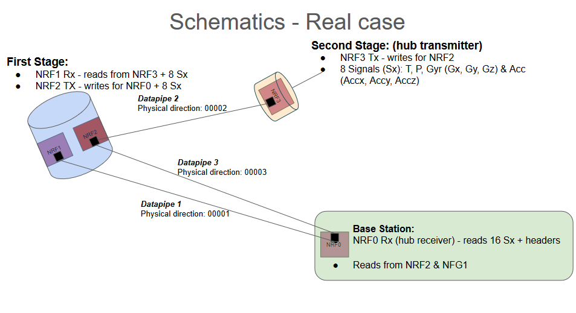
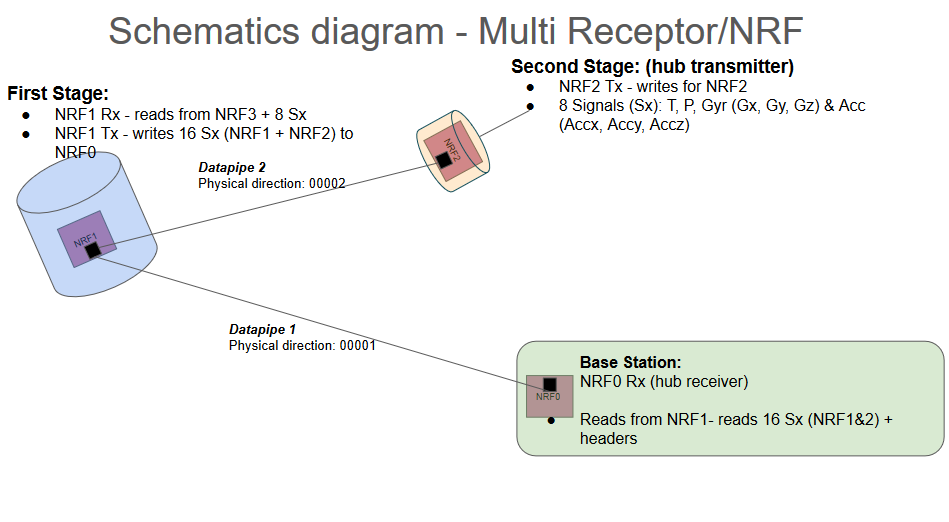
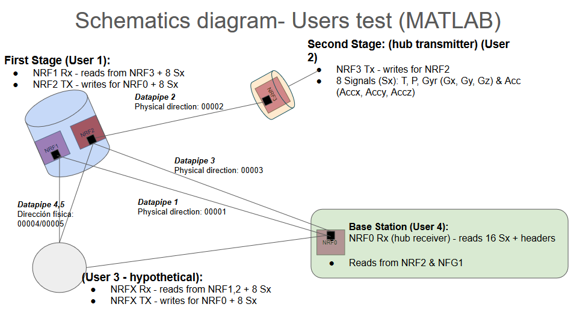

# SATCAN telecommunications system 
First a physical analysis of the system is performed, in particular calculations of the satellite's sink rate, time, acceleration and propeller design. Second, the electronic components are selected according to the system requirements and then the design and implementation of these components is carried out. Third, the satellite is designed in CAD and finally a set of tests are carried out to validate the satellite subsystems.

# Telecommunications system
To introduce synthetic data through input variables, i.e, 8 input signals (T, P, Gyr (Gx, Gy, Gz) & Acc (Accx, Accy, Accz), which are transmitted from S2 to S1 and from S1 to BS; taking into account the amount of NRFs we currently have. A text (representing these variables measured by each stage) can be placed at the interface by hand, for ease of use, since the idea is to change this for a data matrix of 8 signals for a size of N random samples, say (8x5000) which in this case would be easier to maintain in string format or can optionally be changed to numerical (changing the PSK modulation with M=4). In relation to the code, the telemetry system performs the process of quantification, source and channel coding, PSK modulation (M = 2 or 4), a SNR and C/I threshold is established to analyze data loss. Finally, the reception process is done in an analogous way.
NRFs Settings Telecommunications System / CANSAT 

## Schematic diagram N. 1

## Schematic diagram N. 2

## Schematic diagram N. 3

